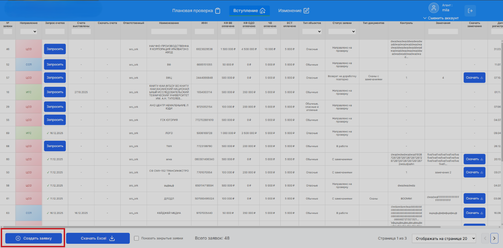
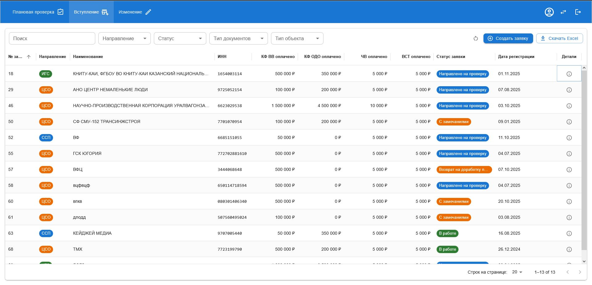

# CRM Table UI

Демонстрационное фронтенд‑решение таблицы CRM на **React + TypeScript + MUI**, выполненное в рамках тестового задания.

Основная цель - **улучшить визуальное оформление, читаемость и удобство работы с таблицей**, сохранив реалистичность CRM‑интерфейса: сортировки, фильтры, статусы, действия и детали строки.

---

## 🎯 Цели и критерии успеха

При разработке я ориентировался на следующие критерии:
- таблица легко читается по строкам и по колонкам
- сортировка и фильтрация очевидны и визуально аккуратны
- статусы и типы заметны
- длинные поля не ломают верстку (ellipsis + tooltip / детали строки)
- действия вынесены из контента и не мешают просмотру данных

---

## 🧱 Используемый стек

- **React 19**
- **TypeScript**
- **Vite**
- **MUI (Material UI)**
- **MUI DataGrid**

Проект полностью фронтенд‑ориентированный, данные используются в виде моков.

---

## ✨ Реализованные улучшения

### 1. Структура и иерархия

- Данные разделены по смыслу: ключевые, числовые, служебные
- Основные поля расположены в начале таблицы
- Числовые значения приведены к единому формату

### 2. Toolbar вместо input’ов в заголовках

- Поиск по № заявки / наименованию / ИНН
- Выпадающие фильтры:
  - Направление
  - Статус
  - Тип документов
- Кнопки действий: «Создать заявку», «Скачать Excel», "Сброс фильтров"

### 3. Таблица

- Фиксированная шапка
- Hover и зебра‑строки для удобства сканирования
- Chip‑компоненты для направлений и статусов

### 4. Длинные поля

- В таблице: обрезка текста (`ellipsis`) + tooltip
- Полные данные отображаются в **Drawer с деталями строки**

### 5. Действия по строке

- Все действия вынесены в одну компактную колонку ("Детали")
- Открытие детальной карточки по иконке в колонке "Детали"
- В деталях доступны контекстные действия:
  - запросить счета
  - скачать счета
  - скачать замечания

### 6. Сортировка и состояния

- Сортировка `asc / desc`
- Сортировка по умолчанию - по номеру заявки
- Поддержка пустых состояний

### 7 Страница деталей (Drawer)

По клику на иконку в колонке "Детали" открывается боковая панель:

- полная информация по заявке
- визуальные бейджи направления и статуса
- контекстные кнопки действий

---

## 🚀 Локальный запуск

```bash
pnpm install
pnpm dev
```

Сборка проекта:

```bash
pnpm build
```

---

## 🌍 Деплой

https://namis-test-sand.vercel.app/

---

## 📝 Примечания

- Проект не претендует на полноту CRM‑системы
- Основной фокус - UX/UI, визуальная иерархия и удобство работы с таблицей
- Архитектура и компоненты готовы к подключению реального API

---

## 📸 Результат

### До


### После



